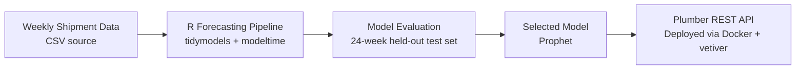

# Distribution Center Demand Forecasting

A weekly demand forecasting pipeline predicting shipment volumes up to 24 weeks out, built in R and deployed as a live Docker API endpoint. Compares Prophet, ARIMA, and ARIMA+XGBoost against a held-out test set to support staffing, inventory, and transportation planning decisions.

## Architecture



## Business Context

Regional distribution centers live and die by their ability to anticipate demand. Understocking during a high-volume week means delayed shipments and frustrated customers. Overstocking means excess inventory, wasted warehouse space, and tied-up capital.

This pipeline builds a weekly demand forecasting model predicting units shipped up to 24 weeks into the future, giving operations teams the visibility they need to make smarter staffing, inventory, and transportation decisions before demand arrives — not after.

## Modeling Approach

The pipeline is built in R using the tidymodels ecosystem. modeltime extends tidymodels into time series territory, wrapping classical forecasting engines into a consistent interface for apples-to-apples comparison. All models were trained on the same recipe and evaluated against a 24-week held-out test set.

Three candidate models were built and compared:

| Model | Engine | Why Chosen |
| --- | --- | --- |
| Auto ARIMA | auto_arima | Classical baseline that handles trend and yearly seasonality automatically |
| ARIMA + XGBoost | auto_arima_xgboost | Combines ARIMA's seasonal backbone with XGBoost modeling the residuals |
| Prophet | prophet | Designed for business time series with multiple seasonalities and holiday flags |

**Prophet was selected as the final model.** It outperformed both alternatives on every key metric — lowest MAE (19,782 units), lowest RMSE (25,365 units), and highest R-squared (0.41) on the 24-week test set. The dramatically lower RMSE compared to ARIMA+XGBoost indicated Prophet handled high-demand spike weeks more robustly.

## Key Results

| Model | MAE | RMSE | MAPE | R² |
| --- | --- | --- | --- | --- |
| Auto ARIMA | 19,911 | 30,633 | 25.4% | 0.06 |
| ARIMA + XGBoost | 20,292 | 39,680 | 26.7% | 0.02 |
| **Prophet (selected)** | **19,782** | **25,365** | **27.4%** | **0.41** |

### Forecast Comparison — Test Period


### Forward Forecast — Next 24 Weeks


## AI Strategy

This project used AI as a collaborative pair programmer across two phases, with two different tools playing different roles.

**Phase 1 (Planning)** was conducted with DeepSeek. The planning session helped identify early that the dataset's peak period labeling was incomplete — several weeks with shipment volumes equal to or exceeding labeled holiday peaks carried no flag at all. That observation shaped modeling priorities from the start.

**Phases 2–4 (Building)** were completed with Claude — most useful for iterative debugging, explaining what each modeltime function was doing under the hood, and diagnosing issues like a Dockerfile dependency conflict with pandoc-citeproc.

**Where I pushed back:** The clearest example was model selection. Visually, ARIMA+XGBoost appeared to track the actual series more closely, and I challenged the recommendation to go with Prophet on that basis. After digging deeper into how RMSE penalizes spike-week errors differently than visual fit suggests, I made the call to go with Prophet — but it was my call, made after genuinely interrogating the tradeoff.

**What I owned vs what AI drove:** The top-level thinking was mine — particularly the emphasis on identifying unlabeled peak periods as a core business problem worth solving. The more technical depth — model syntax, recipe construction, the vetiver deployment pattern — was largely AI-driven, though I inspected every output and drew my own conclusions at each step.

## How to Run

**Reproduce the analysis:**

1. Clone the repository
2. Open `forecast_pipeline.R` in RStudio
3. Install dependencies: `tidyverse`, `tidymodels`, `modeltime`, `timetk`, `lubridate`, `vetiver`, `pins`
4. Run the script top to bottom

**Launch the Docker API:**

```bash
docker build -t forecast-api .
docker run -p 8000:8000 forecast-api
```

Visit `http://127.0.0.1:8000/__docs__/` to explore the live endpoint.

**Send a prediction request:**

```r
library(vetiver)
v_api <- vetiver_endpoint("http://127.0.0.1:8000/predict")
predict(v_api, new_data)
```

## What I'd Improve

- **Peak period feature engineering:** the current binary holiday flag misses unlabeled spike weeks entirely. A better feature would capture shipment volume anomalies relative to a rolling baseline, regardless of whether the business labeled them as peaks.
- **Hyperparameter tuning:** Prophet was selected with one manual adjustment. A proper grid search over changepoint scale, seasonality mode, and holiday weighting would likely push accuracy meaningfully further.
- **Automated retraining:** the model is static. A production version would retrain on a rolling window as new shipment data arrives, with drift monitoring to flag when the forecast degrades.
