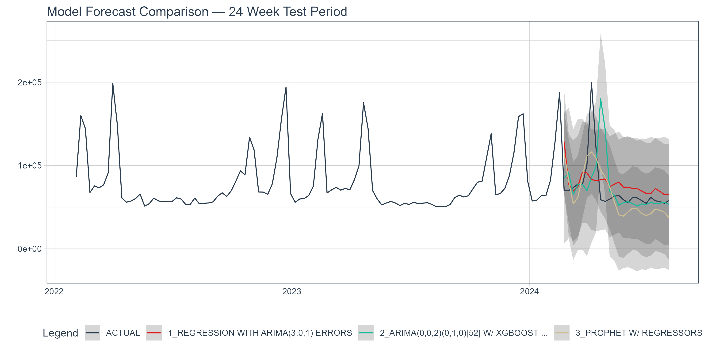
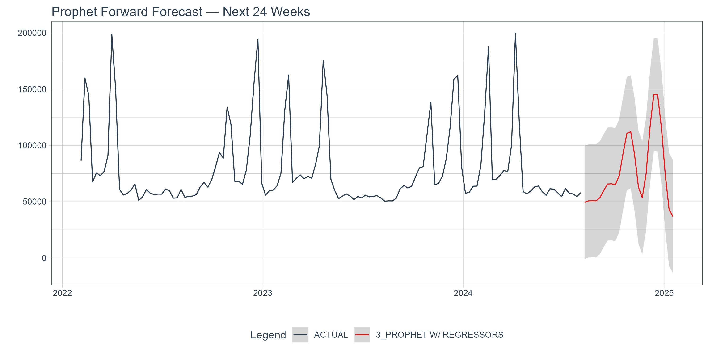

# Time Series Demand Forecasting: Predicting Weekly Shipment Volume for Distribution Center Operations

## Business Context

Regional distribution centers live and die by their ability to anticipate demand.
Understocking during a high-volume week means delayed shipments and frustrated
customers. Overstocking means excess inventory, wasted warehouse space, and tied-up
capital. Neither is acceptable at scale.

This project builds a weekly demand forecasting model to predict units shipped
up to 24 weeks into the future, giving operations teams the visibility they need
to make smarter staffing, inventory, and transportation decisions before demand
arrives — not after.

---

## Modeling Approach

The pipeline is built in R using the tidymodels ecosystem — a standardized
framework for building and comparing machine learning models. modeltime extends
tidymodels into time series territory, wrapping classical forecasting engines
into a consistent interface that allows apples-to-apples comparison across model
types. All models were trained on the same recipe and evaluated against a 24-week
held-out test set.

Three candidate models were built and compared:

| Model           | Engine             | Why Chosen                                                                                               |
| --------------- | ------------------ | -------------------------------------------------------------------------------------------------------- |
| Auto ARIMA      | auto_arima         | A classical baseline that handles trend and yearly seasonality automatically                             |
| ARIMA + XGBoost | auto_arima_xgboost | Combines ARIMA's seasonal backbone with XGBoost modeling the residuals — two bites at the apple          |
| Prophet         | prophet            | Designed for business time series with multiple seasonalities and external regressors like holiday flags |

**Prophet was selected as the final model.** It outperformed both alternatives
on every key metric — lowest MAE (19,782 units), lowest RMSE (25,365 units),
and highest R-squared (0.41) on the 24-week test set. The dramatically lower
RMSE compared to ARIMA + XGBoost indicated Prophet handled the high-demand
spike weeks more robustly than the other candidates.

---

## AI Strategy

This project used AI as a collaborative pair programmer across two phases,
with two different tools playing different roles.

**Phase 1 (Planning)** was conducted with DeepSeek. The boundary between
"planning" and "exploring the data" felt blurry at times — the assignment
asked for both in overlapping phases — so I focused on top-level exploration
to develop intuition about what I wanted the model to actually answer, rather
than diving into full analysis prematurely. The planning session helped me
identify early that the dataset's peak period labeling was incomplete: several
weeks with shipment volumes equal to or exceeding labeled holiday peaks carried
no flag at all. That observation shaped my modeling priorities from the start.

**Phases 2-4 (Building)** were completed with Claude. From personal experience
Claude is stronger for iterative development and debugging, and that held true
here — it was most useful for working through errors incrementally, explaining
what each modeltime function was actually doing under the hood, and helping
diagnose issues like a Dockerfile dependency conflict with pandoc-citeproc.

**Where I pushed back:** The clearest example was model selection. Visually,
ARIMA + XGBoost appeared to track the actual series more closely, and I
challenged the recommendation to go with Prophet on that basis. After digging
deeper into how RMSE penalizes spike-week errors differently than visual fit
suggests, I made the call to go with Prophet — but it was my call, made after
genuinely interrogating the tradeoff. I also questioned removing pandoc-citeproc
from the Dockerfile rather than just accepting the suggestion, and only
proceeded after understanding why the newer version of pandoc made it redundant.

**What I owned vs what AI drove:** The top-level thinking was mine —
particularly the emphasis on identifying unlabeled peak periods as a core
business problem worth solving. The more technical depth — model syntax,
recipe construction, the vetiver deployment pattern — was largely AI-driven,
though I inspected every output and drew my own conclusions from the results
at each step. If I were to extend this project, the next priority would be
refining the model further rather than just shipping a working version —
something I'm aware of and would address with more time.

---

## Key Results

Three models were compared against a 24-week held-out test set. Prophet
outperformed both alternatives across every key metric:

| Model                  | MAE        | RMSE       | MAPE      | R²       |
| ---------------------- | ---------- | ---------- | --------- | -------- |
| Auto ARIMA             | 19,911     | 30,633     | 25.4%     | 0.06     |
| ARIMA + XGBoost        | 20,292     | 39,680     | 26.7%     | 0.02     |
| **Prophet (selected)** | **19,782** | **25,365** | **27.4%** | **0.41** |

Prophet's R² of 0.41 indicated meaningfully better explanatory power than
the other two models, and its RMSE was significantly lower — indicating it
handled high-demand spike weeks more robustly.

### Forecast Comparison — Test Period



### Forward Forecast — Next 24 Weeks



---

## How to Run It

**Reproduce the analysis:**

1. Clone the repository
2. Open `forecast_pipeline.R` in RStudio
3. Install dependencies: `tidyverse`, `tidymodels`, `modeltime`, `timetk`,
   `lubridate`, `vetiver`, `pins`
4. Run the script top to bottom

**Launch the Docker API:**

```bash
docker build -t forecast-api .
docker run -p 8000:8000 forecast-api
```

Visit `http://127.0.0.1:8000/__docs__/` to explore the live endpoint.

**Send a prediction request:**

```r
library(vetiver)
v_api <- vetiver_endpoint("http://127.0.0.1:8000/predict")
predict(v_api, new_data)
```

---

## What I Learned

The most important takeaway from this project is that demand is messier than
it looks. Understanding the flow of goods through a distribution center is
not as simple as flagging holidays and calling it done — real demand spikes
happen outside of what any calendar-based labeling system anticipates. A model
that only knows about labeled peak periods will always be caught off guard by
the ones nobody saw coming. That tension between what the business _thinks_
drives demand and what the data _actually_ shows was the most interesting
thread running through this entire project.

If I were to extend this work, two things would be the priority: first,
investing more time in engineering a better peak period feature — one that
captures the unlabeled spikes the current binary flag misses entirely. Second,
running a proper hyperparameter search on Prophet rather than making one manual
adjustment. Both would likely push accuracy meaningfully further than where
the model currently sits.
