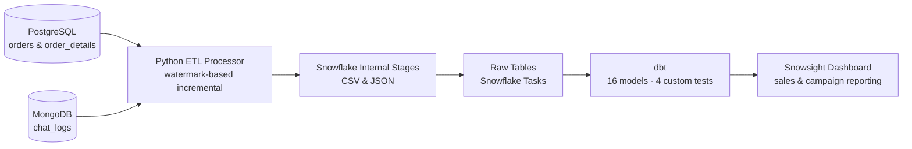

# Sales Analytics Data Pipeline

An end-to-end analytics pipeline that moves operational sales and support data from PostgreSQL and MongoDB into Snowflake, models it with dbt, and serves a Snowsight reporting dashboard.

## Architecture



## What This Project Does

This project takes data from two source systems and three data streams, then turns them into analytics-ready warehouse models:

1. A Python ETL service extracts incremental sales data from PostgreSQL and chat logs from MongoDB.
2. The ETL service lands those extracts into Snowflake internal stages.
3. Snowflake tasks load staged files into raw tables and clean up processed files.
4. dbt stages and transforms the raw data into reusable warehouse models.
5. Final analysis models support sales and email-performance reporting, including a Snowsight dashboard layer.

## End-to-End Flow

### 1. Source systems and containerized generation

The Docker Compose environment brings up the transactional sources and supporting services:

- PostgreSQL stores the core sales data.
- MongoDB stores the chat log data.
- A generator container continuously produces new records.
- The processor container reads from the sources and publishes files to Snowflake stages.
- Adminer is available for database inspection.

### 2. Incremental Python ETL

The processor in [processor/main.py](processor/main.py) is the orchestration entry point. It uses helper modules in [processor/etl](processor/etl) and [processor/utils](processor/utils) to:

- load environment variables from the selected `.env` file,
- connect to PostgreSQL, MongoDB, and Snowflake,
- read the last successful watermark for each source,
- extract only new rows since that watermark,
- write the extracts to stage files as CSV or JSON,
- upload those files into Snowflake internal stages, and
- update the watermark after each successful load.

This keeps the processor incremental instead of re-exporting the same data on every run.

The three data streams handled by the processor are:

- `orders` from PostgreSQL,
- `order_details` from PostgreSQL, and
- `chat_logs` from MongoDB.

### 3. Snowflake raw landing and automation

The warehouse bootstrap script in [load_stages.sql](load_stages.sql) defines the raw landing tables and the automation that moves staged files into them.

It creates:

- `orders_raw`
- `order_details_raw`
- `chat_logs_raw`
- file formats for CSV and JSON ingestion
- Snowflake tasks that COPY data from each stage into the matching raw table
- cleanup tasks that remove processed files from the stages

The result is a hands-off ingestion layer inside Snowflake: once the processor writes files to the stages, Snowflake can load and clear them automatically.

### 4. dbt staging and transformation

The dbt project in [dbt/](dbt) organizes the warehouse into staging, intermediate, and analytical layers across 16 models:

- 5 Adventure DB staging models (customers, inventory, products, vendors, product_vendors)
- 6 e-commerce models (3 base + 3 staging for sales orders, email campaigns, purchase orders)
- 2 real-time models (base + staging for chat logs)
- 3 intermediate models (line items, orders with campaign, orders with customers)

The intermediate layer combines staged sources into business-ready structures:

- [int_sales_order_line_items.sql](dbt/models/intermediate/int_sales_order_line_items.sql) flattens order details into line items.
- [int_sales_orders_with_campaign.sql](dbt/models/intermediate/int_sales_orders_with_campaign.sql) links conversions back to campaign events.
- [int_sales_order_with_customers.sql](dbt/models/intermediate/int_sales_order_with_customers.sql) joins sales to customers and prepares a 30-day sales summary by country.

### 5. Analytics and validation

The analytical queries in [dbt/analyses](dbt/analyses) provide reporting views:

- [campaign_sales_analysis.sql](dbt/analyses/campaign_sales_analysis.sql) summarizes campaign performance by segment, product category, and ad strategy.
- [email_campaign_performance.sql](dbt/analyses/email_campaign_performance.sql) measures opens, clicks, add-to-cart activity, and conversions.

The project includes 4 custom generic dbt tests enforcing business-critical data rules:

- inventory quantities cannot be negative
- preferred vendors must pass a credit check
- a selected product field must remain fully null
- each order may have only one conversion event

## Repository Layout

```bash
compose.yml        # Local orchestration for source systems and the processor
load_stages.sql    # Snowflake raw tables, file formats, COPY tasks, and cleanup tasks
processor/         # Python ETL microservice
dbt/               # dbt project with staging, intermediate, analyses, tests, and seeds
screenshots/       # Reference images for the project walkthrough
```

## How to Run

The pipeline requires a Snowflake account, a PostgreSQL instance, and a MongoDB instance. The Docker Compose environment handles the source systems and processor locally.

1. Copy `.env.example` to `.env` and populate your Snowflake credentials, PostgreSQL connection string, and MongoDB URI
2. Run `docker compose up` to start PostgreSQL, MongoDB, the data generator, and the processor
3. Execute `load_stages.sql` in Snowflake to create raw tables, file formats, and ingestion tasks
4. Run `dbt build` from the `dbt/` directory to execute all models and tests
5. Open Snowsight and connect to the mart layer for dashboard queries

The processor runs incrementally — watermarks are stored in PostgreSQL and updated after each successful load, so restarting it will not re-process already-ingested records.

## Known Limitations and What I'd Improve

- **No error handling in the processor:** if a source connection fails mid-run, the pipeline crashes without a useful error message and the watermark does not update. The next iteration would wrap each extract/load block in try/except with structured logging and dead-letter handling for failed records.
- **No CI/CD:** dbt tests run manually. A GitHub Actions workflow running `dbt build` on every push would catch regressions automatically.
- **Snowflake task scheduling is manual:** tasks are defined in `load_stages.sql` but require manual activation. Airflow or Prefect would give proper DAG-level observability and retry logic.
